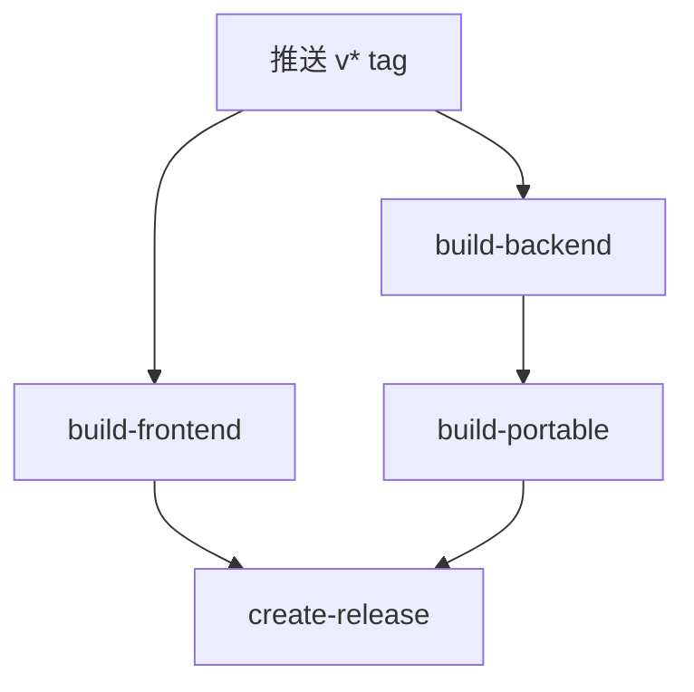

# 版本发布流程

## 触发方式

推送 `v*` tag 到 GitHub 自动触发 Release workflow：

```bash
# 更新版本号（修改以下文件）
# - frontend/package.json
# - backend/main.py
# - backend/api/routes/office.py

# 创建 tag 并推送
git tag vX.X.X
git push origin vX.X.X
```

## release.yml 各 job 说明



### build-backend
- 使用 `pyinstaller --onefile` 构建 `backend_server.exe` + `doc-optimizer-cli.exe`
- 产物上传为 GitHub Actions Artifact

### build-frontend（矩阵构建：6 个平台）
| 平台 | 架构 |
|------|------|
| `windows-latest` | x64, arm64 |
| `ubuntu-latest` | x64 |
| `macos-latest` | x64, arm64 |

**构建步骤：**

```yaml
# 1. PyInstaller 打包后端（onedir 模式 + 显式 add-data）
pyinstaller --onedir --name backend_server \
  --add-data "core;core" --add-data "api;api" --add-data "ai;ai" \
  --add-data "db;db" --add-data "services;services" --add-data "utils;utils" \
  --add-data "config.py;." --add-data "auth.py;." --add-data "main.py;." \
  --hidden-import <全部第三包子模块> \
  frozen_main.py

# 2. 资源目录准备
mkdir -p frontend/dist-resources/backend
cp -r backend/dist/backend_server frontend/dist-resources/backend/backend_server
cp -r rules frontend/dist-resources/backend/rules
cp -r templates frontend/dist-resources/backend/templates

# 3. electron-builder 打包
npx electron-builder --win/--linux/--mac --x64/--arm64 --publish=never
```

### build-portable（Windows 便携版）
- 依赖 build-backend 的 artifact
- 打包为 doc-optimizer-portable.zip

### create-release
- 收集全部 artifact
- 从 `packaging/release-notes-vX.X.X.md` 读取发布说明

## 发布说明

`packaging/release-notes-vX.X.X.md` 格式：

```markdown
## vX.X.X 更新说明

### 本次版本包

| 包名 | 平台 | 说明 |
|------|------|------|
| `doc-optimizer-vX.X.X-win-x64.exe` | Windows x64 | NSIS 安装包 |
| `doc-optimizer-vX.X.X-win-arm64.exe` | Windows ARM64 | 信创 ARM 平台 |
| ... | ... | ... |

### 功能更新

- ...
```

## PyInstaller 注意事项

- 使用 `--onedir` 模式（非 `--onefile`），保留完整目录结构
- `--add-data` 添加 Python 模块目录（core/api/ai/db/services/utils）
- `--add-data` 添加根级模块（config.py/auth.py/main.py）
- `--hidden-import` 列出全部第三方包及其子模块（避免遗漏）
- 入口使用 `frozen_main.py`（含 frozen 模式工作目录初始化）

## 安装后运行时路径

```
resources/
├── backend_server/
│   ├── backend_server.exe    ← 可执行文件
│   ├── _internal/            ← Python 模块（编译后）
│   └── base_library.zip      ← 标准库
├── rules/                    ← YAML 规则文件
├── templates/                ← 模板文件
├── TTF/                      ← 字体文件
└── data/                     ← 运行时数据
```

`frozen_main.py` 自动执行：
```python
os.chdir(os.path.dirname(os.path.dirname(sys.executable)))  # → resources/
```
